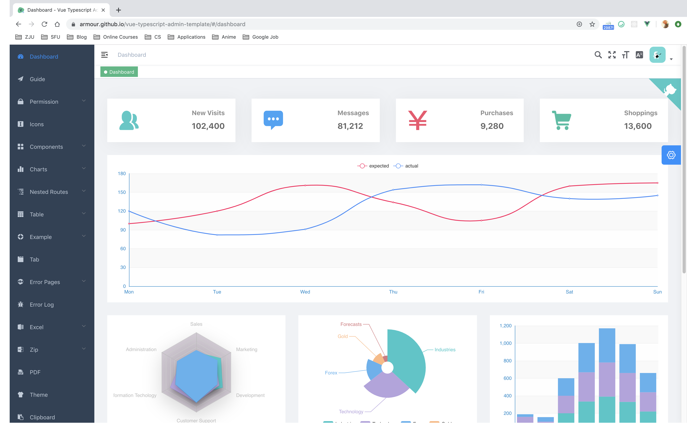

<p align="center">
  
</p>

<p align="center">
  <a href="https://github.com/vuejs/vue">
    
  </a>
  <a href="https://github.com/ElemeFE/element">
    
  </a>
  <a href="https://circleci.com/gh/Armour/vue-typescript-admin-template/tree/master">
    
  </a>
  <a href="http://makeapullrequest.com">
    
  </a>
  <a href="https://opensource.org/licenses/MIT">
    
  </a>
  <a href="https://github.com/Armour/Jarvis">
    
  </a>
</p>

English | [简体中文](./README-zh.md)

## Overview

[vue-typescript-admin-template](http://armour.github.io/vue-typescript-admin-template) is a production-ready front-end solution for admin interfaces based on [vue](https://github.com/vuejs/vue), [typescript](https://www.typescriptlang.org/) and UI Toolkit [element-ui](https://github.com/ElemeFE/element). The original Javascript version code [vue-element-admin](https://github.com/PanJiaChen/vue-element-admin/) was written by [PanJiaChen](https://github.com/PanJiaChen), many thanks to him for the awesome open source project! :)

If you want to get started with a minimal template code instead of integration solution, you can take a look at the [minimal](https://github.com/Armour/vue-typescript-admin-template/tree/minimal) branch.

## Documentation

[Docs](https://armour.github.io/vue-typescript-admin-docs)

## Live demo

[Demo](https://armour.github.io/vue-typescript-admin-template)

## Screenshots



## Related Projects

[Armour/vue-typescript-admin-mock-server](https://github.com/armour/vue-typescript-admin-mock-server) (mock server for this project)

[Armour/vue-typescript-admin-docs](https://github.com/armour/vue-typescript-admin-docs) (documentation source for this project)

Javascript version:

[PanJiaChen/vue-admin-template](https://github.com/PanJiaChen/vue-admin-template) (a vue2.0 minimal admin template) 

[PanJiaChen/vue-element-admin](https://github.com/PanJiaChen/vue-element-admin) (full features supported vue admin) 

[PanJiaChen/electron-vue-admin](https://github.com/PanJiaChen/electron-vue-admin) (a vue electron admin project)

## Features

```txt
- Login / Logout

- Permission Authentication
  - Page permission
  - Directive permission
  - Permission configuration page
  - Two-step login

- Multi-environment build
  - Dev / Stage / Prod

- Global Features
  - I18n
  - Dynamic themes
  - Dynamic sidebar (supports multi-level routing)
  - Dynamic breadcrumb
  - Tags-view (supports right-click operation)
  - Clipboard
  - Svg icons
  - Search
  - Screenfull
  - Settings
  - Mock data / Mock server
  - PWA support

- Components
  - Editors
    - Rich Text Editor
    - Markdown Editor
    - JSON Editor
  - Avatar Upload
  - Back To Top
  - CountTo
  - Dropzone
  - Draggable Dialog
  - Draggable Kanban
  - Draggable List
  - Draggable Select
  - ECharts
  - Mixin
  - SplitPane
  - Sticky

- Table
  - Dynamic Table
  - Draggable Table
  - Inline Edit Table
  - Complex Table

- Excel
  - Export Excel
  - Upload Excel
  - Excel Visualization

- Zip
  - Export zip

- PDF
  - Download pdf

- Dashboard
- Guide Page
- Advanced Example Page
- Error Log
- Error Page
  - 401
  - 404
```

## Preparation

You need to install [node](http://nodejs.org/) and [git](https://git-scm.com/) locally. The project is based on [typescript](https://www.typescriptlang.org/), [vue](https://vuejs.org/index.html), [vuex](https://vuex.vuejs.org/), [vue-router](https://router.vuejs.org/), [vue-cli](https://github.com/vuejs/vue-cli) , [axios](https://github.com/axios/axios) and [element-ui](https://github.com/ElemeFE/element), all request data is simulated using [faker.js](https://github.com/Marak/Faker.js).
Understanding and learning these knowledge in advance will greatly help you on using this project.

## Project Structure

```bash
├── mock/                      # mock server & mock data
├── public                     # public static assets (directly copied)
│   │── favicon.ico            # favicon
│   │── manifest.json          # PWA config file
│   └── index.html             # index.html template
├── src                        # main source code
│   ├── api                    # api service
│   ├── assets                 # module assets like fonts, images (processed by webpack)
│   ├── components             # global components
│   ├── directives             # global directives
│   ├── filters                # global filter
│   ├── icons                  # svg icons
│   ├── lang                   # i18n language
│   ├── layout                 # global layout
│   ├── pwa                    # PWA service worker related files
│   ├── router                 # router
│   ├── store                  # store
│   ├── styles                 # global css
│   ├── utils                  # global utils
│   ├── views                  # views
│   ├── App.vue                # main app component
│   ├── main.ts                # app entry file
│   ├── permission.ts          # permission authentication
│   ├── settings.ts            # setting file
│   └── shims.d.ts             # type definition shims
├── tests/                     # tests
├── .circleci/                 # automated CI configuration
├── .browserslistrc            # browserslist config file (to support Autoprefixer)
├── .editorconfig              # editor code format consistency config
├── .env.xxx                   # env variable configuration
├── .eslintrc.js               # eslint config
├── babel.config.js            # babel config
├── cypress.json               # e2e test config
├── jest.config.js             # jest unit test config
├── package.json               # package.json
├── postcss.config.js          # postcss config
├── tsconfig.json              # typescript config
└── vue.config.js              # vue-cli config
```

## Project setup

With [yarn](https://yarnpkg.com/lang/en/) or [npm](https://www.npmjs.com/get-npm)

#### Install dependencies

```bash
yarn install
```

#### Compiles and hot-reloads for development

```bash
yarn run serve
```

#### Compiles and minifies for production

```bash
yarn run build:prod
```

#### Lints and fixes files

```bash
yarn run lint
```

#### Run your unit tests

```bash
yarn run test:unit
```

#### Run your end-to-end tests

```bash
yarn run test:e2e
```

#### Generate all svg components

```bash
yarn run svg
```

#### Customize Vue configuration

See [Configuration Reference](https://cli.vuejs.org/config/).

## Browsers support

Modern browsers and Internet Explorer 10+.

| [](http://godban.github.io/browsers-support-badges/)</br>IE / Edge | [](http://godban.github.io/browsers-support-badges/)</br>Firefox | [](http://godban.github.io/browsers-support-badges/)</br>Chrome | [](http://godban.github.io/browsers-support-badges/)</br>Safari |
| --------- | --------- | --------- | --------- |
| IE10, IE11, Edge| last 2 versions| last 2 versions| last 2 versions

## Contributing

See [CONTRIBUTING.md](https://github.com/Armour/vue-typescript-admin-template/blob/master/.github/CONTRIBUTING.md)

## License

[MIT License](https://github.com/Armour/vue-typescript-admin-template/blob/master/LICENSE)


```dotnetcli
{
  "name": "vue-typescript-admin-template",
  "version": "1.0.0",
  "private": true,
  "author": "Chong Guo <armourcy@gmail.com>",
  "scripts": {
    "serve": "vue-cli-service serve",
    // "serve": "concurrently \"npm:mock\" \"vue-cli-service serve\"",
    "build:prod": "vue-cli-service build",
    "build:stage": "vue-cli-service build --mode staging",
    "lint": "vue-cli-service lint",
    "mock": "cd mock && ts-node-dev mock-server.ts",
    "svg": "vsvg -s ./src/icons/svg -t ./src/icons/components --ext ts --es6",
    "test:e2e": "vue-cli-service test:e2e",
    "test:unit": "jest --clearCache && vue-cli-service test:unit"
  },
  "dependencies": {
    "@tinymce/tinymce-vue": "^3.2.2",
    "axios": "^0.20.0",
    "clipboard": "^2.0.6",
    "codemirror": "^5.57.0",
    "core-js": "^3.6.5",
    "cors": "^2.8.5",
    "driver.js": "^0.9.8",
    "echarts": "^4.8.0",
    "element-ui": "^2.13.2",
    "faker": "^5.0.0",
    "file-saver": "^2.0.2",
    "fuse.js": "^6.4.1",
    "js-cookie": "^2.2.1",
    "jsonlint": "^1.6.3",
    "jszip": "^3.5.0",
    "lodash": "^4.17.20",
    "morgan": "^1.10.0",
    "normalize.css": "^8.0.1",
    "nprogress": "^0.2.0",
    "path-to-regexp": "^6.1.0",
    "register-service-worker": "^1.7.1",
    "screenfull": "^5.0.2",
    "script-loader": "^0.7.2",
    "sortablejs": "^1.10.2",
    "tinymce": "^5.4.2",
    "tui-editor": "^1.4.10",
    "vue": "^2.6.12",
    "vue-class-component": "^7.2.5",
    "vue-count-to": "^1.0.13",
    "vue-i18n": "^8.21.0",
    "vue-image-crop-upload": "^2.5.0",
    "vue-property-decorator": "^9.0.0",
    "vue-router": "^3.4.3",
    "vue-splitpane": "^1.0.6",
    "vue-svgicon": "^3.2.6",
    "vue2-dropzone": "^3.6.0",
    "vuedraggable": "^2.24.1",
    "vuex": "^3.5.1",
    "vuex-module-decorators": "^0.17.0",
    "xlsx": "^0.16.6",
    "yamljs": "^0.3.0"
  },
  "devDependencies": {
    "@types/clipboard": "^2.0.1",
    "@types/codemirror": "^0.0.97",
    "@types/compression": "^1.7.0",
    "@types/cors": "^2.8.7",
    "@types/echarts": "^4.6.4",
    "@types/express": "^4.17.7",
    "@types/faker": "^4.1.12",
    "@types/file-saver": "^2.0.1",
    "@types/jest": "^26.0.10",
    "@types/js-cookie": "^2.2.6",
    "@types/lodash": "^4.14.160",
    "@types/morgan": "^1.9.1",
    "@types/node": "^14.6.0",
    "@types/nprogress": "^0.2.0",
    "@types/sortablejs": "^1.10.6",
    "@types/tinymce": "^4.5.24",
    "@types/vue-splitpane": "^1.0.0",
    "@types/webpack-env": "^1.15.2",
    "@types/yamljs": "^0.2.31",
    "@typescript-eslint/eslint-plugin": "^3.10.0",
    "@typescript-eslint/parser": "^3.10.0",
    "@vue/cli-plugin-babel": "^4.5.4",
    "@vue/cli-plugin-e2e-cypress": "^4.5.4",
    "@vue/cli-plugin-eslint": "^4.5.4",
    "@vue/cli-plugin-pwa": "^4.5.4",
    "@vue/cli-plugin-router": "^4.5.4",
    "@vue/cli-plugin-typescript": "^4.5.4",
    "@vue/cli-plugin-unit-jest": "^4.5.4",
    "@vue/cli-plugin-vuex": "^4.5.4",
    "@vue/cli-service": "^4.5.4",
    "@vue/eslint-config-standard": "^5.1.2",
    "@vue/eslint-config-typescript": "^5.0.2",
    "@vue/test-utils": "^1.0.4",
    "babel-core": "^7.0.0-bridge.0",
    "babel-eslint": "^10.1.0",
    "concurrently": "^5.3.0",
    "eslint": "^7.7.0",
    "eslint-plugin-import": "^2.22.0",
    "eslint-plugin-node": "^11.1.0",
    "eslint-plugin-promise": "^4.2.1",
    "eslint-plugin-standard": "^4.0.1",
    "eslint-plugin-vue": "^6.2.2",
    "fibers": "^5.0.0",
    "jest": "^26.4.2",
    "lint-staged": "^10.2.11",
    "sass": "^1.26.10",
    "sass-loader": "^10.0.0",
    "style-resources-loader": "^1.3.3",
    "swagger-routes-express": "^3.2.1",
    "ts-jest": "^26.2.0",
    "ts-node-dev": "^1.0.0-pre.60",
    "typescript": "3.8.3",
    "vue-cli-plugin-element": "^1.0.1",
    "vue-cli-plugin-style-resources-loader": "^0.1.4",
    "vue-template-compiler": "^2.6.12",
    "webpack": "^4.44.1"
  },
  "bugs": {
    "url": "https://github.com/armour/vue-typescript-admin-template/issues"
  },
  "gitHooks": {
    "pre-commit": "lint-staged"
  },
  "keywords": [
    "vue",
    "typescript",
    "admin",
    "template",
    "element-ui"
  ],
  "lint-staged": {
    "*.{js,vue}": [
      "vue-cli-service lint"
    ]
  },
  "repository": {
    "type": "git",
    "url": "git+https://github.com/armour/vue-typescript-admin-template.git"
  }
}

```